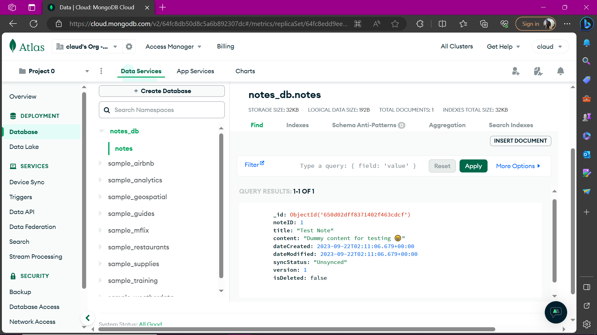

# notes

A new Flutter project.

## Getting Started

This project is a starting point for a Flutter application.

A few resources to get you started if this is your first Flutter project:

- [Lab: Write your first Flutter app](https://docs.flutter.dev/get-started/codelab)
- [Cookbook: Useful Flutter samples](https://docs.flutter.dev/cookbook)

For help getting started with Flutter development, view the
[online documentation](https://docs.flutter.dev/), which offers tutorials,
samples, guidance on mobile development, and a full API reference.


# Documentation

- Main entry file is ```lib/main.dart```

    Stateless widget, contains the header and list of notes (or empty with default text 'Add a note')
    Also contains a button to add a new note


-  ``` lib/components ``` contains all relevant widgets and navigations.

        - Uses stateful widgets to keep track of changes in UI

        - Saves notes to local storage on device (sync when online on user prompt)

        - Delete note and update on server once online
        

-  ``` lib/models ``` contains the model for a note, as well as relevant json transformer methods for REST API and SQL requests.

        It also contains the database helper methods for local SQL queries


The REST API url is defined only once in **lib/components/notes_list.dart** file as it uses the "/read_notes" endpoint to check network connectivity and update state accordingly.

## Build the app

If you want to build the application and run it:

    **Ensure you have flutter installed** (Built with: Flutter V3.13.4, Dart v3.1.2)

    **Also have Java (preferably 11 for compatibility, (built with Java v11.0.20), along with relevant installations (gradle, platform tools and such (built with gradle-7.6.1, DevTools v2.25.0))).
	Refer to the documentations online.**

    **Run ``` flutter pub get ``` to install dependencies

    **Run ``` flutter run``` to start the app (use an emulator (recommended))


I have only tested the android APK, but if you need to build for iOS, consult relevant documentations and the "/lib/*" files should remain as they are.


Make sure to allow install from unknown sources

------------------------------------------------------------------------------


## Backend server

The backend runs on Node with MongoDB as the database. The code is live on github [here](https://github.com/claudwatari95/notes_backend)

 after sync.